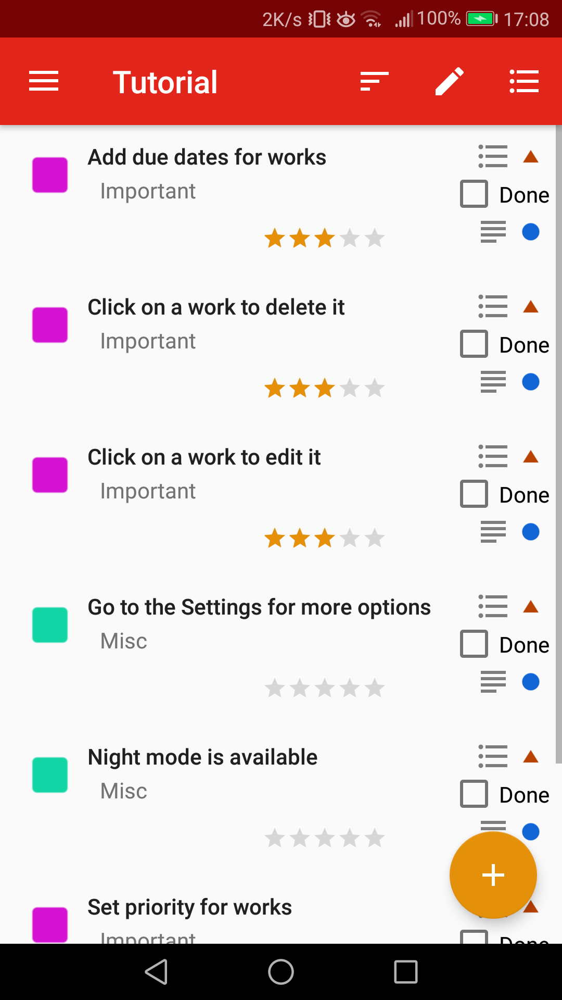
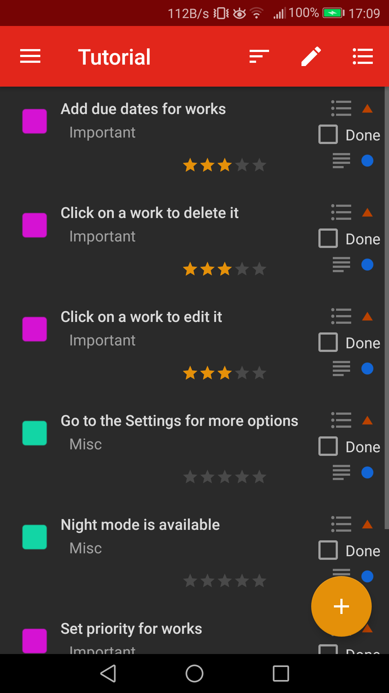

This is a project made in my spare time to learn android app development, so do not expect anything crazy.

This application allows you to save works, associated to a work type, subject and agenda, to keep all your tasks organized.

For each work, you can set a due date, a priority and a description.

And that's about it, hope you will find it useful !

## Contribution
Feel free to contribute to the project, either by reporting bugs, helping with the code or simply with translations.

## Translations
App is currently available in English and French.
